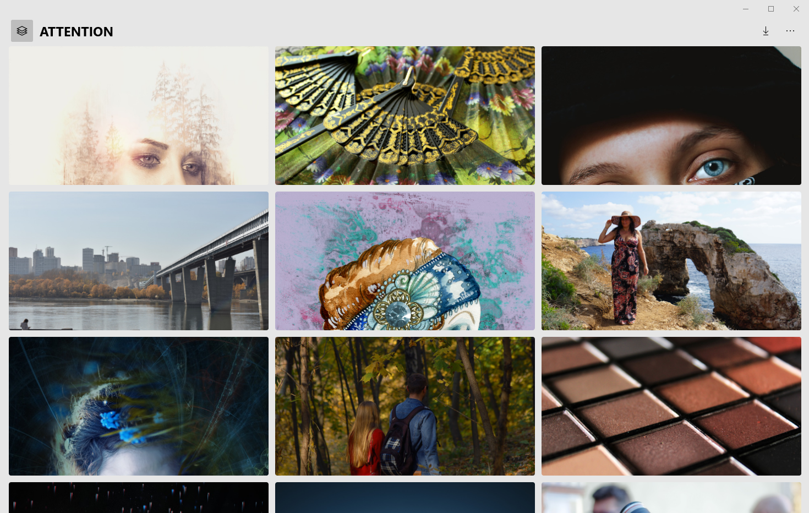

📸

#  Attention.UWP

`The wallpaper client of Pixabay`

## Tntroduction 🎉

This repo is the source code of `Attention.UWP`. it's subject is *[MyerSplash.UWP](https://github.com/JuniperPhoton/MyerSplash.UWP)*. I got some design inspiration from this app, not copying it. 

Now, I'm officially opening up it. If you like this, welcome to download from [releases](https://github.com/hippieZhou/Attention/releases).

If you want to build it by yourself, you should have the following environment:

- OS：Windows 10, version 1903
- Tool: VisualStudio 2019
- SDK: Windows 10 SDK (10.0.18362.0)

## Thanks 💬

- Helpers
  - [JuniperPhoton](https://github.com/JuniperPhoton)
  - [JustinXinLiu](https://github.com/JustinXinLiu)
  - [Niels Laute](https://github.com/niels9001)
  - [DinoChan](https://github.com/DinoChan)
  - [hhchaos](https://github.com/HHChaos)
  - [cnbluefire](https://github.com/cnbluefire)
  - [h82258652](https://github.com/h82258652)

- Toolkit
  - [WindowsCommunityToolkit](https://github.com/windows-toolkit/WindowsCommunityToolkit)
  - [WindowsCompositionSamples](https://github.com/microsoft/WindowsCompositionSamples)
  - [Lottie-Windows](https://github.com/windows-toolkit/Lottie-Windows)
  - [Microsoft.Xaml.Behaviors.Uwp.Managed](https://github.com/Microsoft/XamlBehaviors)
  - [Microsoft.Extensions.DependencyInjection](https://github.com/aspnet/Extensions)
  - [MvvmLightLibs](https://github.com/lbugnion/mvvmlight)
  - [Newtonsoft.Json](https://github.com/JamesNK/Newtonsoft.Json)
  - [PixabaySharp](https://github.com/ThomasPe/PixabaySharp)
  - [sqlite-net-pcl](https://github.com/praeclarum/sqlite-net)

## About 🏷️

Maybe it's a joke. 

I named this app `Attention` only from [Charlie Puth](https://music.163.com/#/song?id=473817398)'s song of the same name, although it didn't start out as the name.

Contact Me：[hippieZhou](htpps://hippiezhou.fun)

## License 💡

The project is released under **MIT License**.

Copyright (c) 2019 hippieZhou